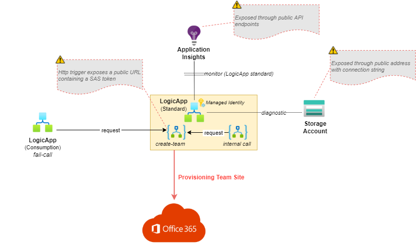

# M365 Provisioning Lockdown

## **Introduction**

This article explains how you can lockdown a basic Office 365 provisioning solution by using Azure Private Endpoints.

Today, using Azure to support Microsoft 365 services is common. We can leverage Azure Function or LogicApp to provision a Teams or SharePoint sites, we can use Azure Automation Account to process governance jobs on Office 365 services and so many other examples.

A common use case is to manage SharePoint/Teams site provisioning (especially since the PnP teams effort on practice and technologies like the PnP Provisioning Engine). This is a great replacement for Office365's default self-service approach, particularly to better manage and govern your tenant and provide better support for users.

On the other hand, from a security perspective, we have a major concern. All these Azure services are accessible using the public network and anyone can try to gain access to it.
Most of the time, services involved in a Office 365 provisioning solution, do not need to be externally exposed as they are the backend part of an entire solution that requires to only expose the endpoint receiving the provisioning request.

To handle this situation, Microsoft released the Azure Private Links/Private Endpoints. You can have the details here: https://docs.microsoft.com/en-us/azure/private-link/private-endpoint-overview, but shortly, here's a quick description from Microsoft:

> "Azure Private Link is a secure and scalable way for Azure customers
> to consume Azure Services from their Azure Virtual Network (VNet). The
> technology is based on a provider and consumer model where the
> provider and the consumer are both hosted in Azure. A connection is
> established using a consent-based call flow and once established, all
> data that flows between the service provider and service consumer is
> isolated from the internet and stays on the Microsoft network. There
> is no need for gateways, network address translation (NAT) devices, or
> public IP addresses to communicate with the service. Azure Private
> Link brings Azure services inside the customer’s private VNet. The
> service resources can be accessed using the private IP address just
> like any other resource in the VNet."

Since their release in 2020, more and more Azure services are compatible with Private Links, even for number of PaaS services commonly used in a Office 365 provisioning solution.
## **Prerequisites**

- A global admin account
- Pre-created Azure Resources Group
- Azure CLI (v. 2.32.0): [Download Azure CLI](https://docs.microsoft.com/en-us/cli/azure/install-azure-cli)
- Azure CLI extensions for LogicApp (still in preview, v. 0.1.2): [Install LogicApp extensions](https://docs.microsoft.com/en-us/azure/logic-apps/set-up-devops-deployment-single-tenant-azure-logic-apps?tabs=azure-cli#install-azure-logic-apps-standard-extension-for-azure-cli)
- Ability to execute Bash scripts to install the solution (on my Windows machine, I use Cmder that includes Bash but you can use other tools, like Git-Bash). - *Note:* we could also have used PowerShell for deployment script).

## **Demo scenario**

Back to our Office 365 provisioning scenario, let's use a basic example of a provisioning solution that consumes these Azure services:
- Azure Storage Account
- Azure LogicApp (Standard)
- Azure App Insights

... and see how we can lock them down from public network.

The demonstration will be in 2 steps:

1. We deploy a solution without Private Endpoints and try to use it from within the same environment and also from outside. We expect the solution to work in both cases.
2. We lockdown the solution using Private Endpoints and try to use it from within the same environment and also from outside. In this case, we shouldN'T be able to call the logicApp endpoint from outside. We expect also not being able to access backend services directly (like Storage Account or App Insights).

Before running the code from the demo, you need to set some parameters in the "deploy-core.azcli" and "deploy-lockdown.azcli" files.

|Parameter| Value |
|--|--|
| *subscriptionId* | Your Azure subscription ID. |
| *resourcesGroup* | The Resources Group name used for deployment (same for both deployment scripts). |
| *resourcesPrefix* | Prefixes of resources to be created (same for both deployment scripts). |
| *ownerEmail* | Email used to provision the Teams owner. |

### **DEMO STEP 1: Implementation without Private Endpoints**

Let's start from a simple provisioning solution involving a Azure LogicApp for execution, a Storage Account and Application Insights for monitoring.

To deploy the first step of the solution, open your command-line tool in bash mode, browse to the ***source*** folder and execute the deployment script by running:

> ./deploy-core.azcli

This deployment script will:
- Deploy the ***template-core-components*** ARM template.
- Set LogicApp's ManagedIdentity Graph permission to create a new Teams and read Users.
- Deploy LogicApp Standard workflows: ***create-team*** to create a Team and ***internal-call*** to test the solution from inside.
- Deploy LogicApp Consumption workflow ***fail-call*** for test from outside.

The implementation is the following:

As mentioned is the diagram, all services expose public endpoints and the communication between then is also done by using these public endpoints.

For example, if someone from anywhere has the LogicApp endpoint URL (that includes the SAS token), he can easily trigger the workflow and try to hack it. The same for other services. Also, when the LogicApp need to communicate with the Storage Account, he naturally uses Storage Account public endpoints.

#### ***Test the demo step 1:***

- **Test 1:** If we trigger the ***create-team*** workflow from inside using the ***internal-call*** workflow it works:
> 
> The call:
> 
> 
> 
> The result:
> 
> 
> 

- **Test 2:** If we trigger the ***create-team*** workflow from outside using the ***fail-call*** workflow it works:
> 
> The call:
> 
> 
> 
> The result:
> 
> 
> 

- **Test 3 (bonus):** If we trigger the ***create-team*** workflow from outside using Postman from my personal PC, it works:

> 

### **DEMO STEP 2: Implementation using Private Endpoints**

    Note: The step 1 must be completed before running the step 2.

To solve this problem, we need to integrate our solution's core services with an underlying network environment that implements Private Endpoints.

You might have some prerequisites and constrains before bringing your solution in an isolated environment (for example, IP adressing or DNS server you would like to use), but for the demo, we will use the default VNet adressing and an Azure Private DNS Zone for DNS.

To deploy the second step of the solution, open your command-line tool in bash mode, browse to the ***source*** folder and execute the deployment script by running:

> ./deploy-lockdown.azcli

This deployment script will:
- Deploy the ***template-lockdown*** ARM template.

Here is the diagram of the targeted solution:

Let's take a look at the different pieces involved here.

#### **Virtual Network**
Because Private Endpoints have to deal with IPs and DNS stuffs, we must use a Virtual Netwok. It will include different Subnets according to our need. For our demo, we need 2 subnets, one dedicated for the AppService hosting the Logic App, and the other to host the Private Endpoints. For our demo scenario, the Storage Account doesn't need to be integrated to the VNet.

#### **Solution core services: LogicApp, Storage Account and Application Insights**

**LogicApp**

To use LogicApp with Private Endpoints, with need a LogicApp Standard and not a Consumption plan. This is required for network integration. Here's some key points about the configuration:

With the Private Endpoint implementation, The LogicApp requires specific function parameters in addition to the commonly used (like WEBSITE_VNET_ROUTE_ALL, WEBSITE_CONTENTOVERVNET for routing, APP_KIND for runtime usage, etc..).

On the *Networking* section, you can see your LogicApp application integrated to the Virtual Network and also the Private Endpoint connection. Notice the internal IP address (10.x.x.x) assigned to the LogicApp instead of a public one.

**Storage Account**

The first thing to consider with our Storage Account isolation is to disabled the public network access. As mentioned earlier, without digging into details, we don't need a network integration for our provisioning solution scenario. We just want to disable public network and access our storage using Private Endpoints.

For the Storage Account, each service must have its Private Endpoint in order to be consumed. If you only use Blob, you can only setup a Private Endpoint for Blob and omit the other.

**Application Insights**

Here, the interesting part is on the *Network Isolation* section.
The Application Insights component doesn't have a native integration to Vnet nor implements Private Endpoints directly. Instead, we rely on an Azure Monitor Private Link Scope and it will take care of implementing Private Endpoints connections for monitoring resources.

Also, we disable the options *Accept data ingestion from public networks not connected through a Private Link Scope* and *Accept queries from public networks not connected through a Private Link Scope*.

#### **Private DNS Zone**

For our demo scenario, we use an Azure Private DNS Zone. To connect privately with your private endpoint, we need a DNS record. We integrate our Private Endpoint with a Private DNS Zone. We could also utilize another DNS servers (ie, in a case of a broader corporate deployment).

#### **Private Endpoints**

They are the core mechanism of our isolation and, for this demo, we gathered them in a single subnet of our Vnet. Under the hood, they rely on Network Interface but it's not important for our scenario. Just keep in mind that for each of your Private Endpoint, you have a Network Interface attached that exposes your endpoint's private IP address.

Here's an example for the LogicApp's Private Endpoint:

#### ***Test the demo step 2:***

- **Test 1:** If we trigger the ***create-team*** workflow from inside using the ***internal-call*** workflow it works:
> 
> The call:
> 
> 
> 
> The result:
> 
> 
> 

- **Test 2:** If we trigger the ***create-team*** workflow from outside using the ***fail-call*** workflow, this time it fails as expected:
> 
> The call:
> 
> 
> 
> The result:
> 
> No result to expect as the call failed.
> 

- **Test 3 (bonus):** If we trigger the ***create-team*** workflow from outside using Postman from my personal PC, it also fails:

> 

**Additional testing for backend services**

Now the solution is locked down, if we try to access directly backend service, we will also hit an access denied (even using the Azure portal).

Example for Storage Account:

Example for Application Insights:

## OK, now my solution is locked down, how do I manage it?

A good option, as shown in the diagram, is to use a Virtual Machine integrated to the Vnet. This way, we will be able to 'talk' to all the services provided by Private Endpoint (because our VM will be able to do Names/DNS resolutions).
Also, one important consideration when using this approach: if you use DevOps to deploy the solution, you need a Self-Hosted agent because the traffic between Microsoft-hosted agents and your services will be over public network and won't work.

## **References**

Private Links and Private Endpoints

- [Private Links and Private Endpoints](https://docs.microsoft.com/en-us/azure/private-link/private-endpoint-overview)

- [LogicApp and Private Endpoints](https://docs.microsoft.com/en-us/azure/logic-apps/secure-single-tenant-workflow-virtual-network-private-endpoint)

- [Storage Account and Private Endpoints](https://docs.microsoft.com/en-us/azure/storage/common/storage-private-endpoints)

- [Application Insights and Private Endpoints](https://docs.microsoft.com/en-us/azure/azure-monitor/logs/private-link-security)

Deploy LogicApp Standard workflows using azure CLI

- [Deploy LogicApp workflows](https://docs.microsoft.com/en-us/azure/logic-apps/set-up-devops-deployment-single-tenant-azure-logic-apps)

